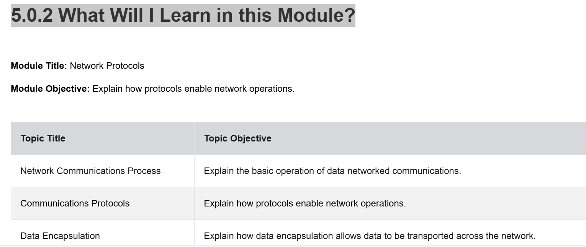

5.0 Introduction
Scroll to begin

### 5.0.1 Why Should I Take this Module?
We all communicate on networks daily. Looking at social media, streaming video, or researching information on the internet are common activities that we normally don’t think much about. However, numerous technological processes are at work to bring us the content that we want from the web.

In this module, you will learn how network protocols work together to allow us to request information and to return that information to us over the network.

### 5.0.2 What Will I Learn in this Module?

Find the module overview image in the Content folder below:

---

5.1 Network Communications Process
Scroll to begin

#### 5.1.1 Networks of Many Sizes
Networks come in all sizes. They range from simple networks that consist of two computers, to networks connecting millions of devices.

Simple home networks let you share resources, such as printers, documents, pictures, and music, among a few local end devices.

Small office and home office (SOHO) networks allow people to work from home, or a remote office. Many self-employed workers use these types of networks to advertise and sell products, order supplies, and communicate with customers.

Businesses and large organizations use networks to provide consolidation, storage, and access to information on network servers. Networks provide email, instant messaging, and collaboration among employees. Many organizations use their network’s connection to the internet to provide products and services to customers.

The internet is the largest network in existence. In fact, the term internet means a “network of networks”. It is a collection of interconnected private and public networks.

In small businesses and homes, many computers function as both the servers and clients on the network. This type of network is called a peer-to-peer network.

**Small Home Networks**

Small home networks connect a few computers to each other and to the internet.

**Small Office and Home Office Networks**

The SOHO network allows computers in a home office or a remote office to connect to a corporate network, or access centralized, shared resources.

**Medium to Large Networks**

Medium to large networks, such as those used by corporations and schools, can have many locations with hundreds or thousands of interconnected hosts.

**World Wide Networks**

The internet is a network of networks that connects hundreds of millions of computers world-wide.

---

#### 5.1.2 Client-Server Communications
All computers that are connected to a network and that participate directly in network communication are classified as hosts. Hosts are also called end devices, endpoints, or nodes. Much of the interaction between end devices is client-server traffic. For example, when you access a web page on the internet, your web browser (the client) is accessing a server. When you send an email message, your email client will connect to an email server.

Servers are simply computers with specialized software. This software enables servers to provide information to other end devices on the network. A server can be single-purpose, providing only one service, such as web pages. A server can be multipurpose, providing a variety of services such as web pages, email, and file transfers.

Client computers have software installed, such as web browsers, email clients, and file transfers applications. This software enables them to request and display the information obtained from the server. A single computer can also run multiple types of client software. For example, a user can check email and view a web page while listening to internet radio.

Examples of common servers:

- File Server - The file server stores corporate and user files in a central location.
- Web Server - The web server runs web server software that allows many computers to access web pages.
- Email Server - The email server runs email server software that enables emails to be sent and received.

Client devices access files with client software such as file explorers; browsers access web servers with browser software; mail clients access email servers with mail client software.

---

#### 5.1.3 Typical Sessions
A typical network user at school, at home, or in the office, will normally use some type of computing device to establish many connections with network servers. Those servers could be located in the same room or around the world. Below are illustrative scenarios showing how network communications occur in everyday use.

**Scenario: Terry (student, BYOD)**
Terry uses her cell phone on school Wi‑Fi to submit search queries. The device encodes the search terms into binary, sends them as radio waves to the school network, converts to electrical signals on wired segments, traverses ISP networks, and reaches the search engine’s servers which respond with results addressed back to Terry’s device.

**Scenario: Michelle (gamer)**
Michelle connects a gaming console via Ethernet to a home network that reaches the ISP by cable modem and router. Gameplay data is sent in many small packets to the game provider’s servers and responses (graphics/audio) are returned quickly to enable real‑time play.

**Scenario: Dr. Awad (medical cloud use case)**
Medical imaging (X‑rays, MRIs) is digitized and securely transmitted to cloud storage and services. Encryption and secure network services protect patient data while enabling doctors to review, collaborate, and consult remotely.

---

#### 5.1.4 Tracing the Path
Network traffic often travels through many different networks and points of presence (PoPs), across Tier 1/2/3 ISPs, Internet Exchange Points (IXP), and regional routers. Because routing policies and peering agreements vary, traffic paths can be indirect and differ between outbound and return routes.

Understanding and tracing the path of traffic is essential for cybersecurity analysts to determine true origins and destinations of network communications.

Illustration (concept): multiple clouds (Internet users → Tier 3 → Tier 2 → Tier 1, PoP, IXP) connected by routers and PoPs, showing many possible paths between source and destination.

---

#### 5.1.5 Lab - Tracing a Route
Lab activities:

1. Verify connectivity to a website (e.g., use `ping` or web browser).
2. Use `traceroute` (Linux) or `tracert` (Windows) to examine the network path to a destination host.
3. Use a web‑based traceroute tool to compare results and observe intermediate hops.

This lab helps you practice path tracing, interpreting hops, and identifying where latency or routing anomalies occur.

---

Notes and further study suggestions:

- Review how protocols at different layers (physical, data link, network, transport, application) interact during typical sessions.
- Practice using network utilities: `ping`, `traceroute`/`tracert`, `nslookup`/`dig`, and packet capture tools like Wireshark.
- Consider lab scenarios for client‑server interactions, secure data transfer (TLS), and routing behavior across ISPs.
